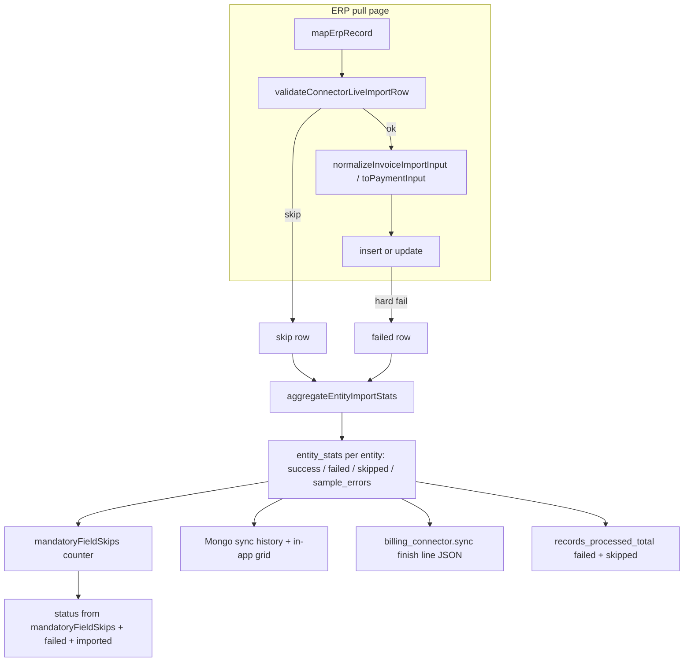

# Billing Connector Mandatory Field Validation

**Status:** Ready for implementation  
**Slug:** `billing-connector-mandatory-field-validation`  
**Related:** [erp_billing_connector_22321e7a.plan.md](./erp_billing_connector_22321e7a.plan.md), [billing-connector-grafana-dashboard.plan.md](./billing-connector-grafana-dashboard.plan.md)

## Overview

Billing-connector **preview** sync already validates required fields via `validateMappedRow`, but **live** import paths (`entityImporter`, `importPaymentService`) can still persist incomplete data:

| Gap | Current behavior | Risk |
|-----|------------------|------|
| Blank amount | Normalized to `0` | Zero-balance invoices/payments |
| Blank currency | Defaults to `USD` | Wrong currency AR |
| Blank invoice date | Defaults to `now` | Wrong aging / FIFO order |
| Blank due date | Omitted / `null` | Missing collection dates |
| Blank invoice number on payment | Deferred with empty `invoice_number` | Unallocated payments |
| Incomplete re-pull | Overwrites stored row | Good data replaced by ERP blanks |
| Failed/skipped visibility | `entityStatsFromCounts` hard-codes `failed: 0`; no `sample_errors` on import rows | Ops cannot see which rows failed in Grafana or Billing tab |

**Goal:** On billing-connector live sync only, **never insert or update** invoice/payment rows when mandatory fields are missing or would be silently defaulted. **Skip the row**, **keep existing data** on updates, **alert** via existing observability stack, and **show failed/skipped imports** with sample reasons in Grafana (staging) and the in-app sync history grid.

## Decision log (mandatory fields — grill-me)

| # | Topic | Decision | Rationale / plan impact |
|---|-------|----------|-------------------------|
| D1 | Incomplete invoice re-pull | Skip update — keep stored row, alert | No overwrite with ERP blanks |
| D2 | New invoice missing mandatory | Skip row only — continue page, alert | Matches ERP plan D21 (per-row skip) |
| D3 | Silent defaults (amount/currency) | Blank → 0 or USD counts as incomplete | Validator runs **before** normalization |
| D4 | Payment invoice number | Required — skip + alert if blank | No unallocated payments |
| D5 | Invoice date default | Blank invoice date is incomplete | No silent “today” |
| D6 | Payment date | Required — skip + alert if missing | Extends payment mandatory set |
| D7 | Incomplete payment re-pull | Skip update — keep stored row, alert | Same as D1 for payments |
| D8 | Alerting | Loki skip logs + `import_validation` metric + PARTIAL + existing Grafana | No new alert rules |
| D9 | Scope | Billing-connector live sync only | File upload unchanged |
| D10 | Customer number | Required on invoices and payments | Linkage prerequisite |
| D11 | Payment before invoice exists | Allow deferred import with `invoice_number`; link when invoice arrives | Keep entity-order flexibility |

## Decision log (sync status & preview — grill-me)

| # | Topic | Decision | Rationale / plan impact |
|---|-------|----------|-------------------------|
| D12 | All rows mandatory-skipped, zero imports | **FAILED** + `import_validation` | Code today returns SUCCESS (`ok: importErrors === 0`, skips ignored) |
| D13 | Preview vs live invoice amount | **OR-rule** — any of `amount` / `base_amount` / `invoice_amount` | Catalog today requires both `base_amount` AND `invoice_amount` (AND) |
| D14 | Mixed import + mandatory skips | **PARTIAL** + `import_validation` | e.g. 197 success + 3 mandatory skips, zero hard failures |
| D15 | Duplicate/idempotency skips vs status | **Mandatory + hard failures only** | 100 unchanged duplicate payments → SUCCESS; do not use raw `skipped > 0` for status/alerts |
| D16 | `sample_errors` pool | **All failed + skipped** (max 3 unique) | Tooltips show duplicates too; status follows D15 via separate `mandatoryFieldSkips` counter |
| D17 | Watermark on mandatory skips | **Advance** | Skipped rows retry only when ERP record changes |
| D18 | Preview validator | **Shared `validateConnectorLiveImportRow`** | OR-rules cannot be expressed via flat `requiredFields` alone |

## Decision log (import visibility — grill-me)

| # | Topic | Decision | Rationale / plan impact |
|---|-------|----------|-------------------------|
| V1 | Grafana visibility | Per-entity `failed`/`skipped` + `sample_errors` on finish lines | Fix `entityStatsFromCounts` always-zero `failed` gap |
| V2 | In-app sync history | Add `skipped` + surface `sample_errors` in Billing tab grid | Parity with Grafana finish-line payload |
| V3 | `sample_errors` cap | 3 per entity per sync; dedupe identical reasons | Matches `last_error` trim pattern |
| V4 | Error message format | Identifier + reason, e.g. `INV-88: missing due_date` | Actionable in Loki and UI |
| V5 | Grafana panels | Loki “import row issues” panel + 24h failed+skipped stat per `entity_type` | Staging dashboard JSON update |
| V6 | UI detail pattern | MUI `Tooltip`, `placement="bottom"`, bullet list of up to 3 messages | Entity stat cells when `sample_errors` non-empty |
| V7 | `sample_errors` sources | Pool failed + skipped row messages; first 3 unique | Full import issue picture per entity |
| V8 | Grafana environment | Staging only | Production dashboard copy deferred |

### Final mandatory-field sets (live sync)

**Invoice:** `customer_number`, `invoice_number`, amount (present and not blank-before-zero), currency (present and not blank-before-USD), `invoice_date`, `due_date`

**Payment:** `customer_number`, `reference`, amount (same rule), currency (same rule), `invoice_number`, `payment_date`

**Explicitly allowed:** Payment with `invoice_number` set but matching invoice not yet in Archaser (`invoice_id: null` until maturity — D11).

**Explicitly out of scope:** Customer, Contact mandatory-field tightening (unchanged); production Grafana dashboard copy; row-level `billing_connector.import_skip` Loki stream as a **required** deliverable (optional — finish-line `sample_errors` is sufficient for V1–V7).

---

## Architecture



**Status vs counters (D12–D15):** `mandatoryFieldSkips` (and `failed`) drive sync **status** and `import_validation` alerts. Entity `skipped` (includes duplicate-payment skips) and `sample_errors` are **informational** for UI, Loki, and Prometheus volume metrics — duplicate skips alone must not change status.

### Validation rules (pre-normalization)

Run on the **mapped row** (output of `mapErpRecord`) **before** `normalizeInvoiceImportInput`, `toPaymentInput`, or any `?? 0` / `|| "USD"` / `?? now` coercion.

| Check | Invoice | Payment |
|-------|---------|---------|
| String fields non-empty | `customer_number`, `invoice_number`, `due_date` | `customer_number`, `reference`, `invoice_number` |
| Date fields non-empty | `invoice_date`, `due_date` | `payment_date` |
| Amount present | `amount` or `base_amount` or `invoice_amount` / `customer_amount` must be present and not `""` | `amount` or `customer_amount` must be present and not `""` |
| Amount not blank→0 | If all amount sources blank/missing → incomplete (actual `0` from ERP is valid) | Same |
| Currency present | `currency` or `customer_currency` non-empty | `customer_currency` non-empty |
| Currency not blank→USD | If both currency fields blank → incomplete (explicit `USD` from ERP is valid) | Same |

**Update guard (D1/D7):** When an existing invoice/payment row would be updated, run the same validator on the incoming mapped row. If incomplete → skip update entirely (DB row unchanged).

### `sample_errors` aggregation (V3–V4, V7, D16)

Shared helper `appendEntityImportIssue(slice, message)` used from invoice batch, payment import, and sync loops:

- **Inputs:** pooled messages from **all failed and skipped** import rows for that entity type (mandatory skips, hard failures, duplicate-payment skips — D16).
- **Message format:** `{identifier}: {reason}` — e.g. `INV-88: missing due_date`, `PAY-42: missing invoice_number`, `PAY-9: unchanged`.
- **Cap:** keep first **3 unique** messages (dedupe exact string match).
- **Output:** `ConnectorEntityStatSlice.sample_errors` on finish + live progress patches.
- **Separate counter:** `mandatoryFieldSkips` incremented only on mandatory-field validation skips (not duplicate-payment skips — D15).

---

## Codebase scan

### Required

| File | Change |
|------|--------|
| `packages/billing-connector/src/import/validateConnectorLiveImportRow.ts` | **New** — shared validator |
| `packages/billing-connector/src/import/aggregateEntityImportStats.ts` | **New** — per-entity counters + `sample_errors` cap/dedupe (V3, V7) |
| `packages/billing-connector/src/import/entityImporter.ts` | `enforceMandatoryFields`; invoice batch validate + issue messages; pass options to payments |
| `packages/billing-connector/src/import/importPaymentService.ts` | Validate + update guard; emit formatted issue messages on fail/skip |
| `packages/billing-connector/src/sync/runInProcessSync.ts` | `enforceMandatoryFields: true`; accumulate `failed` / `skipped` / `mandatoryFieldSkips` per entity; fix `ok` flag (D12–D15); pass `sample_errors` to progress + finish |
| `packages/billing-connector/src/sync/stagedExtensionSync.ts` | Same accumulation; extend `bumpImported` (or equivalent) to accept `skipped` + `mandatoryFieldSkips` |
| `packages/billing-connector/src/sync/runPreviewSync.ts` | Call `validateConnectorLiveImportRow` for Invoice/Payment (D18); keep `validateMappedRow` for Customer/Contact |
| `packages/billing-connector/src/sync/connectorSyncRuntime.ts` | `entityStatsFromCounts` — accept per-entity `failed`, `skipped`, `sample_errors` (today `failed`/`skipped` always `0`) |
| `packages/billing-connector/src/observability/types.ts` | `mandatoryFieldSkips?: number` on sync stats (per entity slice and/or sync total) |
| `packages/billing-connector/src/observability/statusAndErrorType.ts` | D12–D15 status matrix: `mandatoryFieldSkips` + `failed` + imported counts; do not treat duplicate skips as validation failure |
| `packages/billing-connector/src/observability/emitSyncObservability.ts` | `records_processed_total` for `failed` + `skipped`; `import_validation` when `mandatoryFieldSkips > 0` or `failed > 0` (not duplicate-only `skipped`) |
| `packages/billing-connector/src/import/normalizeInvoiceImportInput.ts` | Flag-gated: no silent defaults when `enforceMandatoryFields` (defense in depth) |
| `packages/billing-connector/src/import/normalizePaymentInput.ts` | Same for payment normalizer |
| `packages/billing-connector/src/utils/connectorFieldUtils.ts` | Catalog: add `due_date`, `currency`; remove AND requirement for both amount fields (D13) |
| `packages/billing-connector/src/index.ts` | Export new helpers if needed by tests |
| `grafana/provisioning/dashboards/staging/archaser-billing-connector-staging.json` | **V5** — Loki import-issues panel + 24h failed+skipped stat per `entity_type` |
| `frontend/shared/services/syncHistoryGrid.ts` | Format `pulled / success / failed / skipped`; expose `sample_errors` per entity on grid row |
| `frontend/shared/layout-components/import/ConnectorSyncHistoryGrid.tsx` | **V6** — MUI Tooltip on entity cells (`placement="bottom"`) with bullet list |

### Optional / out of scope unless requested

| File | Notes |
|------|-------|
| `api/src/import/import.service.ts` | File upload — **no change** (D9) |
| `grafana/provisioning/alerting/rules-*.yaml` | Existing `import_validation` + PARTIAL rules suffice (D8) |
| `grafana/provisioning/dashboards/production/*` | **V8** — prod board copy after staging soak |
| Per-row `billing_connector.import_skip` Loki source | Optional verbose stream; finish-line `sample_errors` is the primary surface |
| `frontend/shared/services/syncHistoryGrid.test.ts` | 3-part → 4-part cell format will break when grid changes (update if tests requested) |
| Unit tests | See Testing Strategy — **out of scope unless user requests tests** |
| Translation files | English-only tooltips / log messages in this slice |

### No change needed

| File | Reason |
|------|--------|
| Prisma schema | No new columns; validation + stats are runtime |
| Deferred payment maturity | Unchanged (D11) |
| `api/src/billing-connector/billing-connector.service.ts` | Uses package `resolveSyncExecutionStatus`; no host-layer change once package fixed |
| `frontend/shared/services/backfillImportProgress.ts` | Already reads `sample_errors`; Invoice/Payment inherit Phase 4 progress patches |
| Contact `erp_contact_id` | Catalog marks required; live batch unchanged — explicitly out of scope (D9) |

---

## Phases

### Phase 1 — Shared validator

Create `validateConnectorLiveImportRow.ts`:

```typescript
export type ConnectorLiveImportType = "Invoice" | "Payment";

export interface MandatoryFieldValidationResult {
  ok: boolean;
  missingFields: string[];
  reason?: string; // e.g. "missing due_date"
}

export function validateConnectorLiveImportRow(
  importType: ConnectorLiveImportType,
  mappedRow: Record<string, unknown>
): MandatoryFieldValidationResult;

/** Build V4 message: "INV-88: missing due_date" */
export function formatImportIssueMessage(
  identifier: string,
  reason: string
): string;
```

**Edge cases:** negative amounts and explicit `USD` from ERP are valid; only blank-before-default is rejected (D3).

### Phase 2 — Invoice import guard

In `importInvoiceBatch` when `options.enforceMandatoryFields === true`:

1. Validate each mapped row **before** `normalizeInvoiceImportInput`.
2. On fail: `skipped++`, **`mandatoryFieldSkips++`**, record `formatImportIssueMessage(invoice_number, reason)` via aggregator; do not insert/update.
3. Remove silent defaults when flag is on: no `|| "USD"`, no `?? now` for invoice date.
4. **Update guard (D1):** incomplete re-pull → skip update, keep stored row.

Hard failures (e.g. customer not found) → `failed++` + issue message in same aggregator (V7).

### Phase 3 — Payment import guard

In `importPayments` when `options.enforceMandatoryFields === true`:

1. Validate before prepare loop; on fail → `skipped: true`, **`mandatoryFieldSkips++`**, issue message.
2. **Update guard (D7):** incomplete re-pull → skip update.
3. **Deferred (D11):** valid `invoice_number`, invoice not in DB → keep deferred insert.

### Phase 4 — Sync-only flag + per-entity stats

**Flag `enforceMandatoryFields: true`** only from `runInProcessSync` and `stagedExtensionSync` (not file upload — D9).

**Per sync run, per entity type (`Customer` | `Contact` | `Invoice` | `Payment`), maintain:**

| Field | Source |
|-------|--------|
| `pulled` | ERP page row count (existing) |
| `success` | `importResult.success` (accumulated across pages) |
| `failed` | `importResult.failed` (accumulated) |
| `skipped` | `importResult.skipped` (accumulated — includes duplicate-payment skips) |
| `mandatoryFieldSkips` | Mandatory-field validation skips only (D15) |
| `sample_errors` | Pooled all failed + skipped messages via aggregator (D16, V3, V7) |

Fix `entityStatsFromCounts` to use these values instead of hard-coded `failed: 0`, `skipped: 0`.

**`ok` flag (today broken for skips):** Do not set `ok: importErrors === 0` alone. Derive finish `ok` from status resolution (D12–D15) or pass skip-aware result into `resolveSyncExecutionStatus`.

**Sync finish semantics (D12–D15):**

| Scenario | Status | `error_type` |
|----------|--------|--------------|
| All imported, zero mandatory skips, zero failures | SUCCESS | null |
| Duplicate-only skips (zero mandatory skips, zero failures) | SUCCESS | null |
| Some imported + any mandatory skips and/or failures | PARTIAL | `import_validation` |
| Zero imported + any mandatory skips and/or failures | FAILED | `import_validation` |
| Zero imported, pull/connection errors (no validation issues) | FAILED | per existing classification |

**Note:** `importErrors` today tracks `failed` only. Extend or parallel with `mandatoryFieldSkips` so status logic does not rely on total `skipped`.

### Phase 5 — Observability (D8 + V1)

**On sync finish** (`billing_connector.sync` JSON line):

- `entity_stats` string includes per-entity `failed`, `skipped`, `mandatoryFieldSkips`, `sample_errors`
- `emitBillingConnectorSyncFinish` increments `errors_total{error_type="import_validation"}` when any entity has `failed > 0` or `mandatoryFieldSkips > 0` (**not** duplicate-only `skipped > 0` — D15)
- `records_processed_total{result="failed"}` and `{result="skipped"}` increment from entity stats (powers V5 stat panel; includes all skip types for volume metrics)

**Optional** per-row Loki line (`billing_connector.import_skip`) — same fields as `sample_errors` entry; not required if finish line is sufficient.

**Existing Grafana alert rules** (no new rules): `bc-import-validation-stag`, `bc-partial-stag`.

### Phase 6 — Preview alignment (D13, D18)

1. **`runPreviewSync.ts`:** After `mapErpRecord`, call `validateConnectorLiveImportRow` for Invoice and Payment; map validation failures into existing `validation_errors` format. Keep `validateMappedRow` for Customer and Contact.
2. **`getImportEntityFieldCatalog`:** Invoice `requiredFields` += `due_date`, `currency`; remove AND requirement for both `base_amount` and `invoice_amount` (OR rule lives in shared validator — D13).
3. **`computeMappingCompleteness`:** Mapping UI “all required mapped” may need a note that amount fields are satisfied when **any one** of the amount sources is mapped (align with OR rule).

**Already enforced in live import:** `payment_date` is required today in `importPaymentService.ts`; D6 consolidates into shared validator rather than adding net-new live behavior.

### Phase 7 — Grafana dashboard (V5, V8 staging only)

Update `grafana/provisioning/dashboards/staging/archaser-billing-connector-staging.json`:

1. **Loki panel — “Import row issues”**  
   - Query finish lines where parsed `entity_stats` has any entity with `failed > 0` or `skipped > 0`  
   - Suggested base: existing finish query + filter on `status=~"PARTIAL|FAILED"` or JSON parse of `entity_stats`  
   - Respect `$account_id` variable

2. **Stat panel(s) — “Failed + skipped 24h” per entity type**  
   - `sum by (entity_type) (increase(archaser_billing_connector_records_processed_total{instance="Staging", result=~"failed|skipped"}[24h]))`  
   - One stat or small multi-stat row for Invoice / Payment / Customer / Contact

**Out of scope:** production dashboard JSON in this slice (V8).

### Phase 8 — Frontend sync history (V2, V6)

**`syncHistoryGrid.ts`:**

- `formatEntityStatsCell` → `pulled / success / failed / skipped`
- Pass through `sample_errors` per entity on `SyncHistoryGridRow` (or read from raw run in grid)

**`ConnectorSyncHistoryGrid.tsx`:**

- Entity columns (`customer`, `contact`, `invoice`, `payment`): when `sample_errors?.length`, wrap cell in MUI `Tooltip` with `placement="bottom"`, `arrow`, bullet list of messages
- Reuse existing grid cell typography; minimal layout-only `sx` on Tooltip wrapper only

**Live backfill progress:** `BackfillImportProgress` already reads `entity_stats` / `sample_errors` for `_maturity` — Invoice/Payment slices pick up new fields automatically once Phase 4 emits them on progress patches.

---

## Testing Strategy

> **Note:** Per project rules, tests are **out of scope unless explicitly requested**.

| Req | Business rule | Suggested test unit | Package |
|-----|---------------|---------------------|---------|
| R1–R10 | Mandatory field validation | Validator + import guards | `billing-connector` |
| R11 | File upload unchanged | `importMappedEntityBatch` without flag | `billing-connector` / `api/test` |
| R12 | Mandatory skips → PARTIAL/FAILED + `import_validation`; duplicate skips → SUCCESS | `statusAndErrorType` | `billing-connector` |
| R12b | All mandatory-skipped, zero imports → FAILED | `statusAndErrorType` | `billing-connector` |
| R13 | `entity_stats.failed` / `skipped` / `mandatoryFieldSkips` populated | `entityStatsFromCounts` | `billing-connector` |
| R14 | `sample_errors` cap + dedupe | `aggregateEntityImportStats` | `billing-connector` |
| R15 | V4 message format | `formatImportIssueMessage` | `billing-connector` |
| R16 | Grid shows 4-part cell + tooltip data | `formatEntityStatsCell`, `toSyncHistoryGridRow` | `frontend` |
| R17 | Preview uses shared validator; OR amount rule | `runPreviewSync` + `validateConnectorLiveImportRow` | `billing-connector` |

### How to test (manual)

1. **Staging connector** — trigger sync with deliberate mapping gap (e.g. unmapped `due_date`).
2. **Expect:** Bad row not inserted / stored row unchanged on re-pull; Mongo + in-app history show `Invoice` slice with `skipped > 0` (or `failed > 0` for hard errors).
3. **Billing tab** — Sync history: Invoice column shows `500 / 497 / 0 / 3`; hover shows tooltip with up to 3 messages like `INV-88: missing due_date`.
4. **Grafana (staging)** — Billing Connector dashboard: new “Import row issues” Loki panel shows PARTIAL finish lines; stat panel shows failed+skipped counts by entity; expand finish log → `entity_stats` JSON includes `sample_errors`.
5. **Prometheus** — `records_processed_total{result="skipped"}` increases for Invoice entity_type.
6. **File upload** — Same bad CSV via file upload: behavior unchanged (D9).
7. **Deferred payment** — Valid `invoice_number`, invoice not yet synced: payment still imports (D11).
8. **Duplicate-only skips** — Re-sync unchanged payments: status SUCCESS, `skipped > 0` in entity stats, no `import_validation` alert (D15).
9. **All mandatory-skipped** — All invoices missing `due_date`: status FAILED, `import_validation` alert (D12).

---

## Risks & mitigations

| Risk | Mitigation |
|------|------------|
| High skip volume on bad mapping | Preview (D18) + `sample_errors` + `mandatoryFieldSkips`; fix mapping |
| `skipped` mixes duplicate-payment skips with mandatory skips | D15: only `mandatoryFieldSkips` + `failed` drive status; D16: both appear in `sample_errors` with distinct messages |
| `bc-import-validation-stag` fires on duplicate skips | D15: emit `import_validation` only when `mandatoryFieldSkips > 0` or `failed > 0` |
| Loki panel JSON parse fragility | Filter on `status=~"PARTIAL|FAILED"` first; document expand-log workflow |
| Watermark advances despite skips | D17: `advanceWatermark: true` — intentional |
| Extension staged sync path missed | Both `runInProcessSync` and `stagedExtensionSync`; extend `bumpImported` for `skipped` |
| Preview/live amount rule mismatch | D13 + D18: shared validator; catalog no longer requires both amount fields |
| `ok: importErrors === 0` hides skips | Phase 4: skip-aware status resolution before setting finish `ok` |

---

## Rollout

1. Implement behind `enforceMandatoryFields` (always `true` from connector sync).
2. Soak on staging account 10013 (ERP plan D14).
3. Verify Grafana panels + Billing tab tooltips on staging.
4. Monitor `import_validation` spike and PARTIAL rate for one week.
5. Follow-up: production Grafana dashboard copy (V8).
