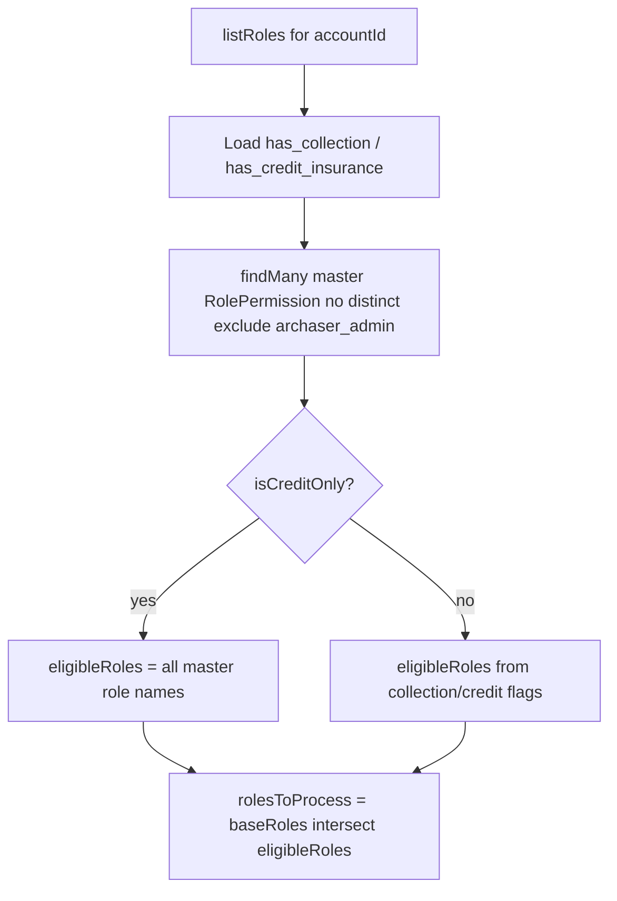

# Port credit-only roles list fix to Nest

## Source (staging)

Repo: [archaser-support/archaser](https://github.com/archaser-support/archaser)  
Merge: `06cc71824` (`credit-insurance` → `staging`)  
Commit: `71df98e2b` — `pages/api/roles/index.ts` + tests

## Decision log

| # | Topic | Decision | Rationale / plan impact |
|---|-------|----------|-------------------------|
| D1 | Nest roles list semantics | Exact staging rules | `isCreditOnly` includes all master roles; remove `distinct`; exclude `archaser_admin` in query; drop empty-set fallback |
| D2 | Clone / bootstrap | Roles list API + Nest tests only | Do not touch `cloneRolePermissions` / account bootstrap |
| D3 | Tests | Both staging scenarios in Nest HTTP test | Rewrite credit-only include-all; add multi-row / no-`distinct` case |

## Behavior to implement

In [`backend/api/src/roles/roles.service.ts`](backend/api/src/roles/roles.service.ts) `listRoles` (for `accountId !== 10013`):

1. Compute `isCreditOnly = hasCreditInsurance && !hasCollection` (same as staging; `hasCollection` already defaults to `true` when undefined).
2. Query master `rolePermission` with `where: { account_id: 10013, role: { not: "archaser_admin" } }` — **no** `distinct: ["role"]`.
3. Build `eligibleRoles`:
   - If `isCreditOnly`: add every `permissionRow.role`.
   - Else: keep current product-flag logic (`collection` OR `credit` match).
4. Set `rolesToProcess = baseRoles.filter((role) => eligibleRoles.has(role))` — **remove** the fallback to `[...baseRoles]` when the set is empty.
5. Keep existing permission-count mapping and final `archaser_admin` safeguard.

## Tests

Update [`backend/api/test/roles-list-product-filter.http.test.ts`](backend/api/test/roles-list-product-filter.http.test.ts):

1. **Credit-only include-all** — Mock credit-only account + collection-tagged-only master rows (`is_credit_insurance: false`). Expect those roles present; **do not** expect roles absent from the master mock (removes old fallback assertion for `Account_Manager`). Still expect no `archaser_admin`.
2. **Multi-row / no-distinct** — Same credit-only account; two rows for `Account_Manager` (collection-tagged first, credit-tagged second). Expect `Account_Manager` in the response.

Assert `findMany` is called **without** `distinct` (optional but useful) if easy with the existing mock.

Run: Nest unit/HTTP test for this file (e.g. `npm run test:unit` filtered, or the project’s usual Jest target for `roles-list-product-filter.http.test.ts`).

## Codebase scan

### Required
- [`backend/api/src/roles/roles.service.ts`](backend/api/src/roles/roles.service.ts) — replace list filter logic
- [`backend/api/test/roles-list-product-filter.http.test.ts`](backend/api/test/roles-list-product-filter.http.test.ts) — both staging scenarios

### Optional / out of scope unless requested
- Monolith `PermissionService.cloneRolePermissions` / Nest account bootstrap (D2)
- Frontend Role dropdown (`UserDetails.tsx`) — already consumes `/api/roles`; no FE change if Nest returns roles
- [`backend/api/src/permissions/permissions.service.ts`](backend/api/src/permissions/permissions.service.ts) — credit-only permission **catalog** filtering is separate from role **names** list
- `api/dist/**` — rebuild artifact; do not hand-edit

### No change needed
- Prisma schema / migrations — uses existing `RolePermission` flags
- Translations / styling
- Frontend `pages/api/roles` — does not exist in archaser-rest FE (Nest owns the route)
- Email welcome credit-only vars — unrelated

## Plan improvements / notes
- Old Nest fallback could show hardcoded roles with **zero** master rows; staging only shows roles present on account `10013`. After this port, an empty master template yields an empty dropdown (correct parity; rare).
- Removing `distinct` also helps dual-product accounts when one of several rows for the same role is credit-tagged.
- Do not edit the source staging plan or re-copy monolith files into Nest beyond the logic above.

## How to verify
1. Run updated Nest HTTP tests.
2. As admin, open user create for a credit-only account (e.g. `10149`): Role dropdown lists master roles (e.g. Account Manager / Collection Agent), not empty and not only `archaser_admin`.
3. Confirm `GET /api/roles?accountId=<credit-only>` returns those roles with permission counts.
