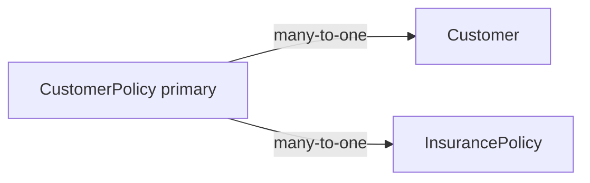

# Add CustomerPolicy to Report Builder

## Decision (locked)

- **Shape:** New selectable primary table `CustomerPolicy` (one row per customer–policy assignment), not more virtual Customer columns.
- **Row set (v1):** Hard-scope execution to **`is_active = true`** only (historical versions out of scope). Still expose `is_active` as a column (always true under this scope).
- **Gating:** Hide the table from metadata when the account lacks `has_credit_insurance`.
- **Existing Customer virtual policy fields stay as-is** (saved reports / Customer-primary grain unchanged).
- **Join UX:** Builder allows max **2** tables; valid pairs are `CustomerPolicy`+`Customer` or `CustomerPolicy`+`InsurancePolicy` (via relationships). Prefer documenting `CustomerPolicy` + `Customer` as the main join.



## Pattern to copy

[`CustomerCollectionPeriod`](w:/Cloudial/archaser-rest/be/reports/src/reports/report-metadata.ts) is the closest peer: no `account_id` on the row; scope via `Customer.account_id`; join Customer many-to-one.

## Backend (reports service)

### 1. Metadata — [`reports/src/reports/report-metadata.ts`](w:/Cloudial/archaser-rest/be/reports/src/reports/report-metadata.ts)

Add table:

- `name: "CustomerPolicy"`, `label: "Customer Policies"`
- Fields from Prisma `CustomerPolicy` (report-useful scalars + nested labels):
  - Identity / audit: `id`, `created_at`, `modified_at`, `customer_id`, `insurance_policy_id`, `is_active`
  - Limit / score: `customer_number_policy`, `approved_limit`, `approved_limit_currency`, `approved_limit_expiration_date`, `zero_limit_date`, `limit_type`, `credit_score`, `credit_score_input_date`, `active_customer_since`, `outdated_dcl`
  - Terms: `max_payment_term`, `max_allowed_mep`, `reporting_days`, `mep_cutoff_day`, `mep_substitute_extra_days`, `reporting_cutoff_day`, `reporting_substitute_extra_days`, `payment_term_cutoff_day`, `payment_term_substitute_day`
  - Exclusion / cost: `excluded_from_policy`, `policy_exclusion_reason`, `cost_percent`, `registration_fee_percent`
  - Gap KPIs: `capacity_gap_amount`, `capacity_gap_amount_date`, `retained_capacity_gap`, `uninsured_amount`, dual-currency `capacity_gap_*` / `uninsured_*`
  - Nested: `Customer.name`, `Customer.customer_number`, `InsurancePolicy.policy_number`
- Reuse existing `translationKey` / `translationNamespace` where keys already exist under `customers` / `common` / `dashboard`; add only missing keys in FE locales (EN+HE).
- Do **not** add a full `InsurancePolicy` metadata table — nested `InsurancePolicy.policy_number` on `CustomerPolicy` is enough (same pattern as Customer today).

### 2. Relationships — [`reports/src/reports/report-relationships.ts`](w:/Cloudial/archaser-rest/be/reports/src/reports/report-relationships.ts)

```ts
Customer → CustomerPolicy (one-to-many, customer_id)
CustomerPolicy → Customer (many-to-one)
CustomerPolicy → InsurancePolicy (many-to-one, insurance_policy_id)
```

### 3. Constants / Prisma maps

- [`reports/src/reports/report.constants.ts`](w:/Cloudial/archaser-rest/be/reports/src/reports/report.constants.ts):
  - `MODEL_NAME_MAP.CustomerPolicy = "customerPolicy"`
  - `RELATION_FROM_PRIMARY.CustomerPolicy = { Customer, InsurancePolicy }`
  - Add `CustomerPolicy: "CustomerPolicy"` under `RELATION_FROM_PRIMARY.Customer` so Customer-primary reports can join the table
- [`reports/src/reports/report-virtual-fields.util.ts`](w:/Cloudial/archaser-rest/be/reports/src/reports/report-virtual-fields.util.ts): add `CustomerPolicy: "CustomerPolicy"` to `REPORT_TABLE_TO_PRISMA_MODEL` (already lists `InsurancePolicy` for DMMF list/scalar checks)

### 4. Account / owner / BU scope — [`reports/src/reports/report-scope.util.ts`](w:/Cloudial/archaser-rest/be/reports/src/reports/report-scope.util.ts)

Treat like `CustomerCollectionPeriod` / `Dispute`:

- `buildAccountScopeWhere`: `{ AND: [{ Customer: { account_id } }, { is_active: true }] }` (or equivalent merge)
- `nestOwnerScopeWhere` / `nestBusinessUnitScopeWhere`: nest through `Customer`

### 5. Execution helpers — [`report-execution.service.ts`](w:/Cloudial/archaser-rest/be/reports/src/reports/report-execution.service.ts)

- Primary scalars: direct Prisma columns (no `extractCustomerPolicyReportField` path).
- Nested Customer / InsurancePolicy selects via `RELATION_FROM_PRIMARY`.
- **`buildSearchWhere`:** for `CustomerPolicy` primary, search `customer_number_policy` and/or nested `Customer.Company.name` / `Customer.customer_number` (mirror CCP-style nested search if present; otherwise minimal `customer_number_policy` + Customer number).
- **`enrichSelectForLinks`:** ensure `customer_id` is selected when Customer name is linked (same branch as Dispute/Activity — include `primaryTable === "CustomerPolicy"` or rely on `tables.has("Customer")`).
- Decimal/money: confirm dual-currency gap field names in [`format-money.util.ts`](w:/Cloudial/archaser-rest/be/reports/src/reports/format-money.util.ts).
- [`report-link.util.ts`](w:/Cloudial/archaser-rest/be/reports/src/reports/report-link.util.ts): `resolveCustomerIdForLink` already walks `row.Customer` / `customer_id` — no new entity link type.

### 6. Grouping — [`report-grouping.util.ts`](w:/Cloudial/archaser-rest/be/reports/src/reports/report-grouping.util.ts)

Extend `detectOneToManyRelationTable` known list: when `primaryTable === "Customer"` and `field.table === "CustomerPolicy"`, treat as to-many (alongside Invoice/Contact/…).

### 7. Credit-insurance metadata gating — [`reports/src/reports/reports.service.ts`](w:/Cloudial/archaser-rest/be/reports/src/reports/reports.service.ts)

Extend `metadata()` to read `has_credit_insurance` and **omit** the `CustomerPolicy` table (and relationships involving it) when false. Do not strip existing Customer virtual CI fields in this slice (out of scope; current behavior — metadata today returns all tables unfiltered).

Also reject execute when `primaryTable === "CustomerPolicy"` and `!has_credit_insurance` (hard fail), so forced configs cannot bypass the picker gate.

## Frontend

Discovery is metadata-driven (`GET /api/reports/metadata`); add i18n / label maps only:

- [`locales/en/reports.json`](w:/Cloudial/archaser-rest/fe/locales/en/reports.json) + HE: `tables.customer_policies`
- [`DragDropFieldSelector.tsx`](w:/Cloudial/archaser-rest/fe/components/reports/DragDropFieldSelector.tsx) `tableTranslationMap`
- [`FilterBuilder.tsx`](w:/Cloudial/archaser-rest/fe/components/reports/FilterBuilder.tsx) `tableTranslationMap` (same keys; CCP is missing here today — include CustomerPolicy)
- [`FormulaColumnEditor.tsx`](w:/Cloudial/archaser-rest/fe/components/reports/FormulaColumnEditor.tsx) `TABLE_TRANSLATION_KEY`
- [`shared/utils/viewColumnGenerator.tsx`](w:/Cloudial/archaser-rest/fe/shared/utils/viewColumnGenerator.tsx) `REPORT_TABLE_NAME_TO_I18N_SLUG` → `customer_policies`
- Field labels via metadata `translationKey`; add EN+HE in `customers.json` only for keys that do not exist yet (cutoff/substitute days, dual-currency gap columns, etc.)

No new entity-list context / `CONTEXT_PRIMARY_TABLE` entry in v1. `DragDropTableSelector` is unused — do not wire it.

## Out of scope (unless requested)

- Inactive / version history rows
- `CustomerPolicyTrend` as a report table
- Removing or relocating existing Customer virtual policy fields
- New system/default reports
- Automated tests (per project rules unless asked)
- Stripping Customer virtual CI fields from metadata for non-CI accounts

## Codebase scan

**Required**

- `be/reports/src/reports/report-metadata.ts`
- `be/reports/src/reports/report-relationships.ts`
- `be/reports/src/reports/report.constants.ts`
- `be/reports/src/reports/report-scope.util.ts`
- `be/reports/src/reports/report-virtual-fields.util.ts`
- `be/reports/src/reports/report-execution.service.ts` (`buildSearchWhere`, `enrichSelectForLinks`)
- `be/reports/src/reports/report-grouping.util.ts`
- `be/reports/src/reports/reports.service.ts` (metadata + execute CI gate)
- `be/reports/src/reports/format-money.util.ts` (gap field names if missing)
- `fe/locales/en|he/reports.json` (+ customers.json for new field keys)
- `fe/components/reports/DragDropFieldSelector.tsx`, `FilterBuilder.tsx`, `FormulaColumnEditor.tsx`
- `fe/shared/utils/viewColumnGenerator.tsx`

**Optional / no change**

- `packages/credit-insurance-domain/.../report-customer-policy-fields.util.ts` — keep for Customer-primary virtual fields
- FE `utils/reportTableUtils.ts` `CONTEXT_PRIMARY_TABLE` — no new context in v1
- Prisma schema — table already exists
- Formula engine — `cost_percent` / `registration_fee_percent` already auto-scale; no table allowlist

## Testing Strategy (manual)

1. Account **with** credit insurance: Report Builder shows **Customer Policies**; select as primary; add limit/terms/gap fields + Customer name + policy number; run — one row per **active** assignment; multi-policy customers return multiple rows.
2. Filter/sort on `approved_limit`, `limit_type`, `is_active`; export CSV; grid search (if used) hits policy/customer number.
3. Account **without** credit insurance: table absent from metadata; execute with forced `primaryTable: CustomerPolicy` rejected.
4. BU/owner-scoped user: only policies for customers in scope.
5. Customer-primary report joining CustomerPolicy (2-table): to-many grouping/select sample behaves; regression: existing Customer `approved_limit` virtual fields still work.
