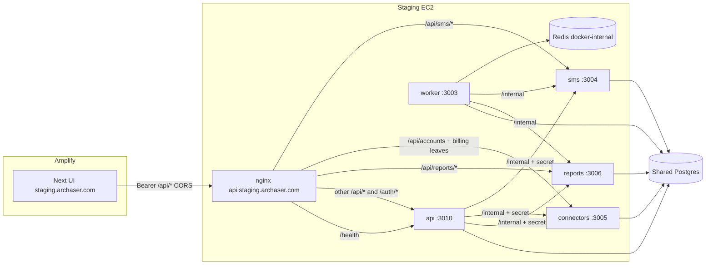

# EC2 staging — `api.staging.archaser.com`

## Overview

Put every Nest service on the **current staging EC2**, publicly reached only as **`https://api.staging.archaser.com`**. The staging UI is **Amplify** at **`https://staging.archaser.com`**. The browser calls the API host (Bearer + CORS). nginx on the EC2 path-splits `/api` to each Compose service. Production is **out of this plan**.

### Objectives

- One public API hostname for staging Nest (api, SMS, connectors, reports).
- Amplify UI works against that host (grids, auth, SSE).
- Emails that hit `/api` (pixels, logos) use the API host, not Amplify.
- The EC2 box is Nest + nginx + Compose only (no Next).

## Decision log

| # | Topic | Decision | Rationale / plan impact |
|---|-------|----------|-------------------------|
| D1 | Where Nest APIs live | Dedicated host **api.staging.archaser.com**; nginx path-split all Nest services | Matches `frontend/amplify.yml`; clean UI vs API split |
| D2 | How the frontend calls the API | **Amplify** is the staging UI; browser calls **api.staging.archaser.com** | Already wired via `NEXT_PUBLIC_NEST_API_BASE_URL` / `NEXT_PUBLIC_API_BASE_URL` |
| D3 | What staging.archaser.com is | **Amplify custom domain** (UI). EC2 nginx serves **only** api.staging | Address bar stays `staging.archaser.com` for the product |
| D4 | Which machine | **Reuse the current staging EC2** as the API box | Compose + peel nginx already live there |
| D5 | How processes run | **Docker Compose** — api, worker, SMS, connectors, reports, Redis | `deploy-backend-docker.sh` is the existing path; do not also run PM2 Nest |
| D6 | Old `/api` on the UI host | **Emit api.staging URLs** for pixels/logos; Amplify does **not** proxy `/api` | Amplify is UI-only; tracking would 404 on the UI host |
| D7 | Plan scope | **Staging only**; production later | Avoid dual DNS/cert/cutover |
| D8 | Next on the EC2 | **Stop Next** — box is Nest + nginx + Compose only | `deploy-staging.sh` must not bring PM2 UI back |
| D9 | Public surface | Internet: **80/443** only — `/api`, `/auth`, `/health`. No `/metrics`, no `/docs`. Redis **not** on a host port | Nest ports stay on localhost for nginx |
| D10 | API host `/` | Redirect to **https://staging.archaser.com** | Humans who type the API host land on the UI |

## Target architecture

**Routing (same peels as today’s `archaser-staging.conf`, new `server_name`):**

| Public path | Upstream |
|-------------|----------|
| `/api/ws` | api :3010 |
| `/api/sms` | sms :3004 |
| `/api/accounts` | connectors :3005 |
| `/api/entities/accounts/:id/billing-connector` | connectors :3005 |
| `/api/entities/accounts/:id/notification-rule-sets` | connectors :3005 |
| `/api/reports` | reports :3006 |
| other `/api/*` | api :3010 |
| `/auth/*` | api :3010 |
| `/health` | api :3010 |
| `/` | 302 → `https://staging.archaser.com` |
| `/internal/*` | **not** on nginx |

The browser still uses **one origin** (`https://api.staging.archaser.com`). It does not call `:3004` / `:3005` / `:3006` itself.

## How the frontend accesses Nest

Amplify has no same-origin `/api` proxy. Product calls already go through `resolveProductApiBaseUrl()` in `frontend/utils/amplifyMode.ts`.

**Amplify Console (staging branch):**

| Variable | Value |
|----------|--------|
| `NEXT_PUBLIC_AMPLIFY_UI` | `true` |
| `NEXT_PUBLIC_NEST_API_BASE_URL` | `https://api.staging.archaser.com` |
| `NEXT_PUBLIC_API_BASE_URL` | `https://api.staging.archaser.com/api` |
| `NEXT_PUBLIC_BASE_URL` | `https://staging.archaser.com` |
| `NEXTAUTH_URL` | `https://staging.archaser.com` |
| `NEXT_PUBLIC_ENABLE_WS` | `true` |

**Nest on EC2:**

| Variable | Value |
|----------|--------|
| `NEST_PUBLIC_URL` | `https://api.staging.archaser.com` (SSO callbacks `/auth/google/callback`, `/auth/azure-ad/callback`) |
| `NEST_AUTH_SUCCESS_REDIRECT` | `https://staging.archaser.com` (after SSO, land on the UI) |
| `NEST_CORS_ORIGINS` | `https://staging.archaser.com` (keep the old `*.amplifyapp.com` origin until custom-domain soak is done, then drop) |
| `NEXT_PUBLIC_BASE_URL` | `https://staging.archaser.com` (portal / login links in emails) |
| `NEXT_PUBLIC_NEST_API_BASE_URL` | `https://api.staging.archaser.com` (pixels / logos / SSE helpers) |

Local Next is unchanged: relative `/api` + `USE_NEST_API_REWRITE=true`. Do not point local at api.staging.

Auth: Amplify already uses Nest Bearer. DualAuth cookie on the API host is not required for this cutover. Google/Microsoft redirect URIs in the cloud consoles must include `https://api.staging.archaser.com/auth/.../callback`.

## How microservices run

On the **existing staging EC2**:

1. `bash backend/scripts/deployment/deploy-backend-docker.sh --env staging`
2. Compose file: `backend/docker-compose.backend.staging.yml`
3. Host nginx (not in Compose) terminates TLS for `api.staging.archaser.com` and proxies to `127.0.0.1:{3010,3004,3005,3006}`
4. S2S stays on the Docker network: `SMS_SERVICE_URL=http://sms:3004`, `CONNECTORS_SERVICE_URL=http://connectors:3005`, `REPORTS_SERVICE_URL=http://reports:3006`
5. Worker stays in Compose (`ENABLE_CRON_JOBS=false` on api — worker owns schedules)
6. Security group: **80/443 only** from the internet. Nest ports and Redis are not public.

**Compose hardening (D9):** remove Redis `ports: ["6379:6379"]` so Redis is docker-internal. Keep Nest `ports` bound to the host loopback if the compose file allows (`127.0.0.1:3010:3010`, etc.) so nginx can reach them without publishing to `0.0.0.0`.

**Stop Next (D8):** do not run `deploy-staging.sh` against this box. Stop/delete PM2 `archaser-staging`. New deploys are backend Compose + nginx reload only.

## Impact analysis

### Codebase search

- nginx: `backend/nginx/archaser-staging.conf` is `server_name staging.archaser.com` and still publishes `/metrics` `/docs` and 302s `/` to Amplify.
- Amplify comments already name `api.staging.archaser.com`; no nginx/DNS for that host exists.
- CORS: only `backend/api/src/main.ts` calls `enableCors`. `sms`, `connectors`, `reports` do not — Amplify → `/api/reports` and `/api/sms` will fail the browser preflight without this.
- Email pixels: `packages/cron-jobs/src/email/emailTrackingUtils.ts` prefers `NEXT_PUBLIC_BASE_URL` (UI) before the Nest URL — wrong after D3/D6.
- Logos in templates: `processTemplateContent.ts` / `authUtils.ts` use `NEXTAUTH_URL` (UI host).
- SSO: `NEST_PUBLIC_URL` + `/auth/.../callback` already exists.
- Deploy: `deploy-backend-docker.sh` is the Compose path; `deploy-staging.sh` still ships Next.

### Affected areas

- **nginx / DNS / TLS:** new site + cert for api.staging; Amplify custom domain for staging.archaser.com.
- **Nest peels:** CORS on public apps.
- **Worker/email:** API host for `/api/...` assets; UI host for human links.
- **Frontend:** Amplify Console env only (no product-screen changes). Rebuild Amplify after env change (`NEXT_PUBLIC_*` is build-time).
- **i18n / theme:** no change.
- **Production nginx/compose:** no change (D7).

## Codebase scan

### Required

| File | Why |
|------|-----|
| `backend/nginx/archaser-staging.conf` (or new `archaser-staging-api.conf`) | `server_name api.staging.archaser.com`; peels; `/health`; `/` → UI; drop `/metrics` `/docs`; no `/internal` |
| `backend/sms/src/main.ts` | CORS for Amplify origin |
| `backend/connectors/src/main.ts` | CORS |
| `backend/reports/src/main.ts` | CORS |
| Prefer small shared helper (e.g. in `@archaser/auth`) used by all four `main.ts` files | One origin list; api already has the pattern |
| `backend/docker-compose.backend.staging.yml` | Redis not published; bind Nest ports to `127.0.0.1` |
| `backend/packages/cron-jobs/src/email/emailTrackingUtils.ts` | Pixel/click URLs → `NEST_PUBLIC_URL` / `NEXT_PUBLIC_NEST_API_BASE_URL` |
| `backend/packages/cron-jobs/src/templates/processTemplateContent.ts` | Logo `/api/accounts/:id/logo` → API host |
| `backend/api/src/email/` if it builds the same URLs | Same rule as cron-jobs |
| Amplify Console env + Nest `.env.staging` on EC2 | Table above |
| Google / Microsoft OAuth redirect URIs | `https://api.staging.archaser.com/auth/.../callback` |
| Host firewall / SG | 80/443 only |
| Let’s Encrypt | Cert for `api.staging.archaser.com` on this EC2 |
| DNS | `api.staging.archaser.com` → this EC2; `staging.archaser.com` → Amplify custom domain |
| Stop PM2 Next; stop using `deploy-staging.sh` on this host | D8 |

### Optional / out of scope unless requested

| Item | Why |
|------|-----|
| `frontend/utils/emailTrackingUtils.ts` / `frontend/utils/authUtils.ts` | Staging emails are sent by Nest worker, not Amplify SSR. Align later if anything still sends from Next. |
| `backend/nginx/archaser-staging-amplify-cutover.conf` | Superseded by API-only nginx + Amplify custom domain |
| Production `api.archaser.com` | D7 |
| Grafana hostname | Stays as today (not on api.staging) |
| Folding peels into one Nest process | Out of scope |
| Typed OpenAPI client cutover | Out of scope (`next-nest-screen-parity.plan.md`) |

### No change needed

| Item | Why |
|------|-----|
| Peel path map (`/api/sms`, `/api/reports`, narrow connectors) | Already correct; only the hostname changes |
| `frontend/utils/amplifyMode.ts` | Already uses Console absolute URLs when Amplify |
| Local Next rewrites | Still same-origin `/api` |
| `/internal` + `INTERNAL_SERVICE_SECRET` | Already docker-only (D44 in nest migration plan) |
| Prisma / DB | Shared Postgres unchanged |
| Translations, theme | No UI copy/layout work |

## Implementation steps

1. **CORS on peels** — same `NEST_CORS_ORIGINS` / `NEXT_PUBLIC_BASE_URL` list as `api/src/main.ts`, `credentials: true`.
2. **Email/API URLs** — two bases: UI host for portal/login; `NEST_PUBLIC_URL` for `/api/email/track-open`, click wraps, and `/api/accounts/:id/logo`.
3. **nginx** — new server block for `api.staging.archaser.com` (copy peel locations from current staging conf; apply D9/D10).
4. **Compose** — Redis internal; loopback publish for Nest ports; `deploy-backend-docker.sh --env staging`.
5. **TLS + DNS** — certbot for api.staging; point A/ALIAS at the EC2; **do this before** moving `staging.archaser.com` off EC2.
6. **Amplify env + rebuild** — table above; smoke while `staging.archaser.com` may still be the old EC2 302 (or amplifyapp.com).
7. **SSO consoles** — add API-host callbacks; set `NEST_PUBLIC_URL` / `NEST_AUTH_SUCCESS_REDIRECT`.
8. **Amplify custom domain** — attach `staging.archaser.com`; then remove UI/`/api` from EC2 nginx for that name.
9. **Stop Next** — `pm2 stop/delete archaser-staging`; do not run `deploy-staging.sh` here.
10. **Tighten** — drop `/metrics` `/docs` if they were still on the old site; confirm SG.

**Cutover order (blocking):** api.staging healthy (step 6) **before** moving `staging.archaser.com` DNS to Amplify. Otherwise `/api` on the old name dies before the new name is live.

**Rollback:** keep the previous `staging.archaser.com` nginx site disabled-but-on-disk until soak. Point `staging.archaser.com` DNS back to the EC2 if Amplify custom domain fails. api.staging can stay; Amplify Console can temporarily use `https://staging.archaser.com` as `NEXT_PUBLIC_NEST_API_BASE_URL` only if that EC2 site is restored (avoid that unless rollback).

## Testing strategy

| Requirement | Decision | How |
|-------------|---------|-----|
| API host serves Nest | D1, D5 | `curl -I https://api.staging.archaser.com/health` → 200 from api |
| Path peels | D1 | `/api/sms` → sms; `/api/reports` → reports; `/api/accounts` → connectors; `/api/customers` → api |
| `/internal` dark | existing D44 | `/internal/health` (or similar) from the public host → 404 from nginx |
| Not public | D9 | `/metrics`, `/docs` → 404; Redis 6379 closed from internet |
| Root | D10 | `https://api.staging.archaser.com/` → 302 to UI |
| Amplify grid | D2 | Login on staging.archaser.com → Customers rows via `api.staging.../api/reports/.../execute` |
| CORS | D2 | Browser network: preflight on `/api/reports` and `/api/sms` succeed |
| SSE | D2 | Notifications stream to `api.staging.../api/ws/notifications?access_token=` |
| Email pixel | D6 | Sent mail HTML `img src` starts with `https://api.staging.archaser.com/api/email/track-open` |
| Portal link in email | D6 | Human links still `https://staging.archaser.com/...` |
| SSO | D1 | Google callback hits api.staging `/auth/google/callback`, then redirect to UI |
| No Next on EC2 | D8 | `pm2 ls` has no `archaser-staging`; port 3001 down |
| Local unchanged | — | `USE_NEST_API_REWRITE=true` still peels to localhost Nest |

## Discovery gates

| Gate | Kind | If yes | If no |
|------|------|--------|-------|
| Staging EC2 already running Compose Nest + Redis | blocking | Add nginx/DNS/CORS on top | Run `deploy-backend-docker.sh --env staging` first |
| Amplify staging branch builds with Console env | blocking | Rebuild after URL env change | UI will keep calling the old host |
| Let’s Encrypt can issue for `api.staging.archaser.com` (DNS pointed at EC2) | blocking | TLS on nginx | HTTP-only is not acceptable for Amplify mixed content |
| Route53 (or current DNS) can attach Amplify custom domain | blocking D3 | UI hostname cutover | Stay on amplifyapp.com until DNS works; keep that origin in `NEST_CORS_ORIGINS` |
| Google/Microsoft redirect URIs updated | blocking SSO | Staging SSO works | Password login still works; SSO 404s/mismatch |
| Postgres `max_connections` vs five Nest pools | informational | Leave pool sizes as compose | Document only; do not retune unless errors |

## Risks

| Risk | Mitigation |
|------|------------|
| Flip UI DNS before api.staging works | Order: API host + Amplify env smoke, then custom domain |
| CORS only on main API | Peels get the same `enableCors` (required todo) |
| `deploy-staging.sh` reinstalls Next | D8: stop using it on this host; document in deploy README comments in the nginx file |
| Emails still use UI host for `/api` | Prefer `NEST_PUBLIC_URL` for those paths (D6) |
| Compose + PM2 both bind 3010 | D5/D8: Compose only |
| Redis left on `0.0.0.0:6379` | D9: drop host publish |

## Plan edits (other docs)

- [x] `nest_microservice_migration_a9cacddc.plan.md` — Stage 1B APIs on **api.staging.archaser.com**.
- [x] `next-nest-screen-parity.plan.md` — staging re-check is Amplify + api.staging.
- [x] `frontend/amplify.yml` comments — `NEST_PUBLIC_URL` and pixels on the API host.
- [ ] Production `api.archaser.com` — **not this plan** (D7).
