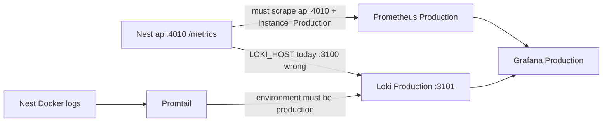

# Fix production Grafana No data (Prometheus + Loki)

## Problem

Production Grafana ([grafana.portal.archaser.com](https://grafana.portal.archaser.com)) shows **No data** on most panels (Prometheus KPIs and Loki/log panels). Staging works with the same dashboard patterns using `instance="Staging"` / `environment="staging"`.

Evidence from codebase scan ([Prod Grafana label/scrape mismatch](1acb73c6-4cb3-41fb-85ed-326d7b9b6072)): production Nest listens on **4010/4003**, but Prometheus still scrapes **3010/3003**.



## Ranked hypotheses (updated)

1. **Prometheus scrape port mismatch (primary for Prometheus No data)** — [`grafana/prometheus-production.yml`](grafana/prometheus-production.yml) targets `api:3010` / `worker:3003`, but [`docker-compose.backend.production.yml`](docker-compose.backend.production.yml) sets `NEST_PORT`/`PORT` **4010** and `WORKER_PORT` **4003**. Targets stay DOWN → home/infrastructure/billing Prometheus panels empty. SMS/connectors/reports ports (3004–3006) already match.
2. **Promtail docker job hardcodes `environment: staging`** in [`grafana/promtail-config.yaml`](grafana/promtail-config.yaml) while production dashboards query `environment="production"` → nest-docker Loki panels empty.
3. **Production Nest `LOKI_HOST=http://host.docker.internal:3100`** while production Loki publishes on host **3101** (`start-production.sh`) → direct Nest log push misses production Loki (or hits staging Loki on 3100).
4. **Broken Grafana recreate via** [`scripts/deployment/deploy-production.sh`](scripts/deployment/deploy-production.sh) (raw compose without `--project-name` / `BACKEND_DOCKER_NETWORK`) vs [`grafana/start-production.sh`](grafana/start-production.sh).
5. Mongo datasource wrong DB — Billing Connector history panels only; secondary.

## Approach

### Phase A — Confirm on the EC2 host (feedback loop)

Run against production monitoring (Prometheus **9091**, Loki **3101**, Grafana **3201**):

```bash
# Prometheus targets — expect archaser-api / archaser-worker DOWN today
curl -s 'http://127.0.0.1:9091/api/v1/targets' | jq '.data.activeTargets[] | {job:.labels.job, instance:.labels.instance, health:.health, scrapeUrl:.scrapeUrl}'

# From Prometheus container — expect fail on 3010, success on 4010 after Nest is up
docker exec archaser-prometheus-production wget -qO- http://api:3010/metrics | head
docker exec archaser-prometheus-production wget -qO- http://api:4010/metrics | head

# Loki labels
curl -s -G 'http://127.0.0.1:3101/loki/api/v1/label/environment/values' | jq .
curl -s -G 'http://127.0.0.1:3101/loki/api/v1/series' --data-urlencode 'match[]={job="nest-docker"}' | jq .
```

**Pass criteria after fixes:** api/worker targets `health=up` with `instance=Production`; Loki nest-docker (and/or direct-push) series queryable with `environment=production`.

### Phase B — Code fixes

1. **Fix Prometheus production scrape ports** in [`grafana/prometheus-production.yml`](grafana/prometheus-production.yml):
   - `api:3010` → `api:4010`
   - `worker:3003` → `worker:4003`
   - Leave sms/connectors/reports at 3004/3005/3006
   - Keep `instance: Production` / `nest_service` relabels

2. **Promtail env-aware labels** — Make docker (and PM2) `environment` follow `MONITORING_ENV`:
   - Template + render in [`grafana/start-production.sh`](grafana/start-production.sh) / [`grafana/start-staging.sh`](grafana/start-staging.sh) (same pattern as Mongo datasource render)
   - Mount generated file from [`grafana/docker-compose.logging.yml`](grafana/docker-compose.logging.yml)

3. **Align production Nest → Loki push port** — Set `LOKI_HOST` in [`docker-compose.backend.production.yml`](docker-compose.backend.production.yml) to `http://host.docker.internal:3101` (match `LOKI_HOST_PORT` in `start-production.sh`), or document a single shared contract and enforce it in both places.

4. **Fix deploy-production.sh Grafana reload** — Call `bash backend/grafana/start-production.sh` (or equivalent project/network/port flags). Do not raw-recreate Grafana without the production network.

5. **Redeploy monitoring** — `bash grafana/start-production.sh` so Prometheus reloads the new scrape file and Promtail gets new labels.

### Phase C — Verify in UI

- Home / Infrastructure: `up`, postgres/mongo connected show values.
- Billing Connector: Prometheus KPIs + Loki run-history panels populate.
- Explore → Loki: `{job="nest-docker", environment="production"}` (and/or `{environment="production"} |= "billing_connector.sync"`) returns lines.

## Codebase scan

**Required**
- [`grafana/prometheus-production.yml`](grafana/prometheus-production.yml) — wrong api/worker ports
- [`grafana/promtail-config.yaml`](grafana/promtail-config.yaml) — hard-coded docker `environment: staging`
- [`grafana/start-production.sh`](grafana/start-production.sh) / [`grafana/start-staging.sh`](grafana/start-staging.sh) — render promtail; already set correct networks/ports
- [`grafana/docker-compose.logging.yml`](grafana/docker-compose.logging.yml) — mount generated promtail config
- [`docker-compose.backend.production.yml`](docker-compose.backend.production.yml) — `LOKI_HOST` port 3100 vs monitoring 3101
- [`scripts/deployment/deploy-production.sh`](scripts/deployment/deploy-production.sh) — unsafe Grafana recreate

**Optional / out of scope unless requested**
- Filter Promtail docker SD by compose project so staging/prod don’t both scrape every container on a shared host
- Align production dashboard Loki selectors with direct-push labels (`service`, no `job=nest-docker`) if Promtail path is abandoned
- [`scripts/deployment/check-monitoring-stack.sh`](scripts/deployment/check-monitoring-stack.sh) — staging-oriented; extend for production ports
- Mongo sync-history datasource tuning

**No change needed**
- Dashboard JSON under `grafana/provisioning/dashboards/production/` — `instance="Production"` / `environment="production"` filters are correct once ingest matches
- Alert rules — same label contract; fire once metrics flow
- Staging prometheus/compose ports — already aligned at 3010/3003

## Testing strategy

- Host curl / `wget` checks above as the primary red/green loop (Phase A before fix → red; Phase C after → green).
- After Promtail fix: query a **recent** time window (old series may retain `environment=staging`).
- No automated unit tests for YAML/compose (ops verification only).
