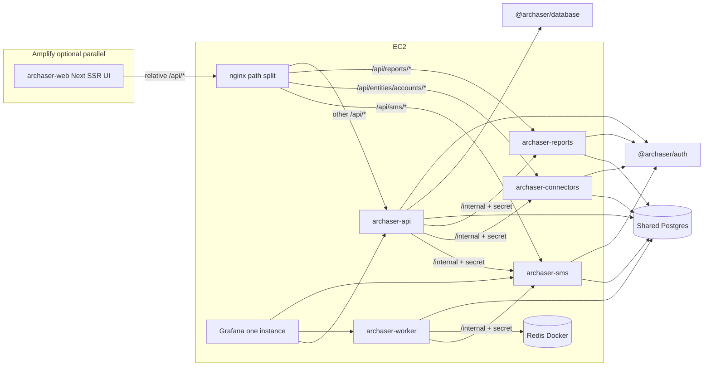

# Nest.js backend split — living roadmap

**Status:** Lane A peels done · Worker 18/18 · **Staging+prod cutover templates applied** (`ENABLE_CRON_JOBS=false`, nginx peels on, main-API peel modules deleted) · Amplify Stage 1B wiring done (staging UI redirect)  
**Next action:** Deploy/reload on hosts · set `NEST_CORS_ORIGINS` for Amplify · smoke peels + worker · optional deepen cron gaps (email/templates)

| Lane | Next |
|------|------|
| **A — Peels / stubs** | Host deploy: reload nginx + compose; smoke SMS/connectors/reports |
| **B — Amplify** | Amplify Console env + CORS; prod Amplify cutover optional (EC2 UI remains) |
| **Worker cron** | Worker owns schedules; known gaps accepted at cutover |

**Resume file:** keep this document updated when a stage finishes (`Status`, decision log, “Next action”).

## Target architecture

**Routing rules:**

- Browser / UI: relative `/api/...` only — **no** second FE base URL (D25).
- nginx (prod/staging) and Next rewrites (local) path-split to each Nest port (D25, D30).
- `/internal/...` is **never** published on nginx — docker/private network only (D44).
- No browser-facing `/api/gateway/...` peel proxies — remove `GatewayPeelController` (D50).

## Decision log (locked)

### Original (D1–D21)

| # | Topic | Decision |
|---|-------|----------|
| D1 | Backend shape | Nest modular monolith first, then peel microservices |
| D2 | Auth owner | Nest owns auth; Amplify UI is client-only |
| D3 | Auth transport | JWT in `Authorization: Bearer` |
| D4 | Stage 1 cutover | EC2 first (Nest beside Next), then Amplify UI |
| D5 | Data | Shared Postgres for a long time |
| D6 | First peel | Cron / worker |
| D7 | Grafana | One Grafana; dashboards/folders per service |
| D8 | Tests (original) | **Superseded by D17** |
| D9 | Peel order after worker | SMS → Billing connectors → Reports |
| D10 | Amplify | Next SSR on Amplify; no DB/business logic in Next |
| D11 | API ↔ worker | Queue-based (not DB-only handoff) |
| D12 | Queue | Redis + Bull/BullMQ |
| D13 | Redis hosting | Redis in Docker on app EC2 |
| D14 | UI → services | **Superseded by D24–D26** — path-split to each Nest app; not main-API gateway proxy |
| D15 | Schedules | Worker owns BullMQ repeatables (from CronJob config); API = config + run-now |
| D16 | Repo layout | Separate FE and BE repositories (not a monorepo) |
| D17 | Initial repos | `archaser-web` + backend + e2e (backend holds Nest workspace) |
| D18 | Contracts | OpenAPI from Nest + codegen in web — **extended by D31** (per-app + merge) |
| D19 | Peel packaging | **Superseded by D22** — Nest apps stay in backend repo (not new git repos per peel) |
| D20 | Prisma | `@archaser/database` workspace package; private npm **not required** for in-repo peels |
| D21 | Bootstrap | Strangler inside repo first — **done**; FE/BE already split |

### Grill update Aug 2026 (D22–D52)

| # | Topic | Decision |
|---|-------|----------|
| D22 | Repo + Nest apps | Own Nest app per service; all in **backend** repo; run in **parallel** |
| D23 | Peel timing | Move real work **now**: SMS → connectors → reports |
| D24 | SMS HTTP | Public `/api/sms/*` on **sms** Nest app; main API drops those routes after soak |
| D25 | Browser routing | nginx path split; UI keeps relative URLs; no second FE base URL |
| D26 | Connectors + reports HTTP | Same: each Nest app owns public routes; path-split |
| D27 | Connectors URLs | Keep nested URLs (no FE path rename) |
| D28 | Connectors scope | **All** `/api/entities/accounts/*` → connectors (“nested accounts” service) |
| D29 | Auth sharing | `@archaser/auth` workspace package |
| D30 | Local routing | Next.js rewrites path-split to each Nest port (mirror nginx) |
| D31 | OpenAPI | Each Nest app publishes OpenAPI; CI merge → one FE client |
| D32 | Server-side SMS | api/worker HTTP → sms via `SMS_SERVICE_URL` |
| D33 | Service auth | `/internal/...` + shared secret; DualAuth on `/api/...`; guard in `@archaser/auth` |
| D34 | S2S connectors/reports | Same DualAuth public + `/internal` + `CONNECTORS_SERVICE_URL` / `REPORTS_SERVICE_URL` |
| D35 | AccessScope | In `@archaser/auth` with Nest DB helper; depends on `@archaser/database` |
| D36 | SMS cutover | Reversible nginx/Next path flip; delete main-API SMS only after soak |
| D37 | Connectors/reports cutover | Same reversible flip + soak playbook |
| D38 | Amplify vs peels | **Parallel tracks** — neither blocks the other |
| D39 | Peels kickoff | Start SMS peel immediately; copy/adapt auth into sms as needed |
| D40 | `@archaser/auth` timing | Extract **during SMS soak, before connectors**; connectors use package day one |
| D41 | Worker vs SMS | Independent — SMS does not wait on full worker domain handlers |
| D42 | DB pools | api **10**, worker **5**, sms/connectors/reports **3–5** each; document vs Postgres `max_connections` |
| D43 | Internal secret | One `INTERNAL_SERVICE_SECRET` for all Nest apps (`x-internal-service-secret`) |
| D44 | `/internal` exposure | Never on nginx; docker/private only |
| D45 | SMS peel done | No path flip until live Twilio send + webhook signature checks match production behavior |
| D46 | Twilio parity source | Spike: recover from prod/staging runtime or git/`server` SMS history; then port into sms |
| D47 | Connectors/reports bar | Same high bar when Nest differs from older live path |
| D48 | Source of truth | **Live prod/staging wins**; old git/`server`/`pages` only if still live or Nest is stub/wrong (SMS Twilio) |
| D49 | Parity proof | Automated contract tests (golden HTTP + authz); flip only when green |
| D50 | Gateway peel proxies | Remove `GatewayPeelController` / browser gateway forwards |
| D51 | S2S HTTP client | Shared helper for api + worker |
| D52 | S2S client home | Helper lives in **`@archaser/auth`** |

## Peel playbook (each of SMS / connectors / reports)

1. Confirm live source of truth (D48) — spike if Nest is stub/wrong.
2. Move/implement domain on the target Nest app (public DualAuth `/api/...` + `/internal/...` for S2S).
3. Golden HTTP contract tests vs live main-API (or live) responses (D49).
4. Reversible nginx + Next rewrite path flip (D36–D37).
5. Soak; then delete module from main API.
6. After SMS soak starts: extract `@archaser/auth` and refactor api + sms onto it **before** connectors (D40).

## Staged backlog

### Stage 0 — Foundation — **DONE**

- Nest API, JWT, OpenAPI, `@archaser/database` path established.

### Stage 1A — Nest API strangler + Nest-native domains — **DONE** (slices 01–19)

- Core AR, portal/CI, remaining monolith APIs, Nest domain modules; jiti strangler retired for product HTTP.
- FE/BE already separate repos; backend is Nest workspace under `api/`, `worker/`, `sms/`, `connectors/`, `reports/`.

### Stage 1B — Amplify UI — **Lane B — wiring done**

- Amplify Hosting SSR; JWT Bearer + OpenAPI client (`@archaser/openapi-client` + FE `nestOpenApiClient`).
- Staging nginx redirects UI to Amplify; Nest APIs stay on EC2.
- Console env + `NEST_CORS_ORIGINS` remain host/ops steps.
- Production Amplify cutover optional (EC2 Next UI remains).

### Stage 2 — Worker deepen — **cutover applied**

- Compose (staging + production): `ENABLE_CRON_JOBS=false` — worker owns BullMQ schedules.
- **All CronJob names live via `@archaser/cron-jobs`** (including Activity Workflow Manager).
- **Accepted gaps:** email SMTP stubbed; template variable fill incomplete; AWM schedule calc simplified; Report Scheduler needs `REPORTS_SERVICE_URL` + internal execute for full S2S.
- Credit/customers domain loaded from `api/dist` (`CREDIT_INSURANCE_DOMAIN_ROOT` / `CUSTOMERS_DOMAIN_ROOT` overrides).

### Stage 3 — SMS (`sms` Nest app) — **peeled + flipped**

- Public `/api/sms/*` on sms Nest; DualAuth except public webhook.
- nginx peels ACTIVE (staging + production); main API `api/src/sms` deleted.
- `/internal/...` for api/worker with `INTERNAL_SERVICE_SECRET`.

### Stage 3b — `@archaser/auth` — **done**

- DualAuth, internal-secret guard, AccessScope + Nest DB helper, S2S HTTP client (D29, D33, D35, D52).

### Stage 4 — Connectors (`connectors` Nest app) — **peeled + flipped (narrow)**

- Owns `/api/accounts` + billing-connector + notification-rule-sets leaves (account-admin bank-accounts/BUs stay on main API).
- `ENABLE_CONNECTORS_SYNC_WORKERS=true` on connectors service; main API `accounts-nested` deleted.

### Stage 5 — Reports (`reports` Nest app) — **peeled + flipped**

- Owns public `/api/reports/*`; main API reports module deleted (util kept for credit-insurance).

### Out of scope unless requested

- DB-per-service; separate Grafana instances; peeling core AR (Customer/Invoice/Activity) early; Redis → ElastiCache (revisit after worker harden); **new git repo per peel** (superseded by D22); production Amplify UI cutover.

**Host deploy still required** (compose up + `nginx -t` / reload). Known cron gaps (email SMTP, AWM template extras) accepted at cutover.

#### Worker soak → cutover

1. ~~Dual-run with `ENABLE_CRON_JOBS=true`~~ → **done path:** staging/production compose set `ENABLE_CRON_JOBS=false`.
2. Gate: `npm run soak:check` (expects peels ACTIVE in nginx templates).
3. Registry gate: `npm run soak:cron-registry`.
4. After deploy: watch worker logs + CronJobExecution; run-now via `POST /api/gateway/cron/:jobId/run-now`.
5. Known gaps listed in `WORKER_SOAK_KNOWN_GAPS` (accepted unless product escalates).

#### Path-flip soak → cutover

1. Staging + production nginx: SMS + narrow connectors (`/api/accounts` + billing/notification leaves) + reports **ACTIVE**.
2. Main API duplicates deleted: `api/src/sms`, `accounts-nested`, reports controllers (kept `report-customer-policy-fields.util.ts` for credit-insurance).
3. Connectors: `ENABLE_CONNECTORS_SYNC_WORKERS=true` on connectors service (D72).
4. Local Next: `USE_*_NEST_REWRITE` optional for peel-local; FE rewrite narrowed to match nginx.
5. Rollback: re-comment nginx locations and restore hybrid UI if needed.

#### Amplify SSR (Lane B) — **wiring done; Console/DNS is ops**

1. Staging nginx `location /` → 302 Amplify (`$amplify_ui_origin`); hybrid EC2 Next kept as commented rollback.
2. FE: `@archaser/openapi-client` + `utils/nestOpenApiClient.ts`; `amplify.yml` documents Nest CORS + env.
3. Ops: Amplify Console env (`NEXT_PUBLIC_NEST_API_BASE_URL`, secrets) + Nest `NEST_CORS_ORIGINS` includes Amplify origin.
4. Production UI remains EC2 Next unless a separate Amplify prod cutover is requested.

## Codebase scan (peels track)

**Required (done):**

- `backend/sms`, `backend/connectors`, `backend/reports` — Nest peels live
- Main API peel modules deleted after flip (`sms`, `accounts-nested`, reports controllers)
- `@archaser/auth`, nginx path splits, FE `nest-api-rewrite.cjs`, OpenAPI client, compose service URLs

**Optional / later:** ElastiCache; private npm publish; deepen worker email/templates; production Amplify UI cutover.

**No change needed for peels:** Core Customer/Invoice/Activity ownership on main API; product feature plans unrelated to migration.

## Discovery gates (blocking / informational)

| Gate | Type | Blocks |
|------|------|--------|
| Recover live Twilio send + webhook signature path (prod/git/`server`) | **done** | SMS Twilio path |
| Recover Priority billing sync from frontend git (~81bd37a) | **blocking** | S11 live sync |
| Per-peel: confirm live SoT (Nest vs still-legacy) | blocking | That peel’s flip |
| Postgres `max_connections` ≥ sum of pool defaults (api 10 + worker 5 + peels 3–5×3) | blocking | All services in parallel in an env |
| Amplify SSR + i18n/middleware without server DB | blocking | Lane B Amplify complete |
| Docker Redis durability/backup acceptable for prod jobs | informational | Later ElastiCache |
| Private npm for `@archaser/database` | informational | Only if publishing outside backend workspace |
| `@archaser/auth` extracted | **done** (S8) | S11 coding start (D67) |

## Stub inventory & fix order (grill Aug 2026)

**Order (D55):** **S8 → S11 → S12 → P0**

| ID | Sev | Item | Status |
|----|-----|------|--------|
| S8 | P1 | Inforu/MessageBird SMS send | **Done** (`@archaser/sms-send` + wired api/sms; `@archaser/auth` extracted) |
| S11 | P2 | connectors Nest scaffold + full D28 peel + Priority sync | **Done** + path flip on (narrow peel); workers on after flip |
| S12 | P2 | reports Nest scaffold peel | **Done** + path flip on; main-API reports module deleted |
| S1–S5 | P0 | Ops create, credit assign, PTP post, billing sync fake, import leaves | **Done** (dispute-reasons create; assignCredit deepened; PTP wired; import records; in-process sync) |
| S6–S10 | P1 | Ops lists/updates, worker cron handlers, … | **Done** — 18/18 + `ENABLE_CRON_JOBS=false` in compose |
| S13–S17 | P3 | S3 stubs, openapi client, CI helper naming | **Done (1B wiring)** — openapi-client + FE nestOpenApiClient; Amplify staging redirect |

### Grill decisions D53–D72 (locked)

| # | Decision |
|---|----------|
| D53 | Full stub inventory before code |
| D54 | Peel scaffolds (S11–S12+S8) then P0 |
| D55 | **S8 → S11 → S12 → P0** |
| D56 | Inforu: DB `api_key` + `api_secret`/`auth_token` only |
| D57 | S8 on both api + sms Nest apps |
| D58 | `@archaser/sms-send` shared package |
| D59 | Inforu webhook status = follow-up |
| D60 | Single-message send only (no batch in S8) |
| D61 | S11 = full D28 peel + real billing sync |
| D62 | Move nested `/api/accounts/:id/*` settings to connectors |
| D63 | Connectors owns sync (not shared worker yet) |
| D64 | HTTP queued → connectors BullMQ |
| D65 | Connectors owns `sync_cron_expression` repeatables |
| D66 | Entire `AccountsController` → connectors |
| D67 | `@archaser/auth` required before S11 (S8 extracts it) |
| D68 | Priority ERP only; other providers fail clearly |
| D69 | `@archaser/billing-connector` package |
| D70 | Path-split off until soak |
| D71 | Pre-flip: main API in-process sync via package |
| D72 | Connectors queue/schedules disabled until path flip |

### S11 notes

- nginx/Next: `/api/entities/accounts/` + `/api/accounts/` → connectors (after flip)
- `check-username` stays on main API (`/api/entities/users/...`)
- Recover Priority stack from frontend git history

## Testing strategy (peels)

- **Parity gate (D49):** golden HTTP fixtures — same requests → same status/shape as current live main-API (or live) responses; include authz cases; path flip only when green.
- **After flip:** operational soak with reversible nginx/Next switch before deleting main-API module (D36–D37).
- **OpenAPI:** per-service specs merged for FE client (D31).
- **Worker / Amplify:** own tracks; e2e smoke as those lanes advance.

## How to resume in a later session

1. Open this plan; read **Status** / **Next action** (lanes A and B).
2. Do not re-litigate locked D1–D72 unless explicitly changing a decision (then update the table).
3. Lane A peels done · worker owns schedules · nginx peels flipped in-repo · Amplify staging wiring done → **deploy hosts** + smoke.

## Issues (vertical slices)

Historical tracer bullets under `.scratch/nest-microservice-migration/` (01–19 done). New peel work should follow this plan’s Stage 3–5 playbook; republish slices with `/to-issues` if desired.

**Status:** 01–19 done · cutover templates in repo · **Next:** host deploy / CORS / smoke
