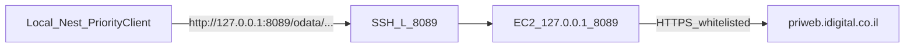

# Bypass Priority whitelist via EC2 proxy

Yes — use a **proxy on the EC2**, not Nest opening SSH on every OData call.

## Why not “endpoint SSHs into EC2”

A local Nest route that `ssh` + `curl`s Priority per request is slow, flaky (auth, multiplexing, timeouts), and a poor fit for paged OData (`$top`/`$skip`/keyset). Reject that design.

## Chosen approach: EC2 reverse proxy + one SSH tunnel



1. **On staging EC2** — run a reverse proxy bound to **`127.0.0.1:8089` only** that forwards to `https://priweb.idigital.co.il`. Prefer **nginx** (existing host pattern). Not public on `0.0.0.0`.
2. **On laptop** — one long-lived tunnel:
   ```bash
   ssh -N -L 8089:127.0.0.1:8089 ubuntu@YOUR_STAGING_EC2_HOST
   ```
3. **Local Billing connector** — set base URL to:
   `http://127.0.0.1:8089/odata/Priority/tabula.ini/idigita`
4. Priority Basic/PAT auth stays on the request as today (`PriorityClient` Authorization header). Proxy does not store ERP credentials.
5. No `NODE_TLS_REJECT_UNAUTHORIZED` — local hop is plain HTTP to loopback; EC2↔Priority is normal HTTPS.

### Example nginx snippet (EC2, localhost only)

```nginx
server {
  listen 127.0.0.1:8089;
  location / {
    proxy_pass https://priweb.idigital.co.il;
    proxy_ssl_server_name on;
    proxy_set_header Host priweb.idigital.co.il;
    proxy_http_version 1.1;
    proxy_buffering off;
  }
}
```

### Verify

```bash
# laptop, tunnel up
curl -sS -G 'http://127.0.0.1:8089/odata/Priority/tabula.ini/idigita/CUSTOMERS' \
  -H "Authorization: Basic ${AUTH}" \
  --data-urlencode '$top=1'
```

Then Run Preview Sync against the local Nest stack.

## Explicitly out of scope

- Nest route that shells out to `ssh` / `curl` on each Priority call
- Public internet Priority relay on EC2 without auth / without localhost bind
- Changing production connector URLs
- Mongo cache replay (still valid for Start-only; does not help Preview)

## Optional later (not this plan)

Authenticated Nest `/internal/priority-odata` on staging API if you want the relay inside Compose instead of host nginx — same tunnel pattern, more code/auth surface.
