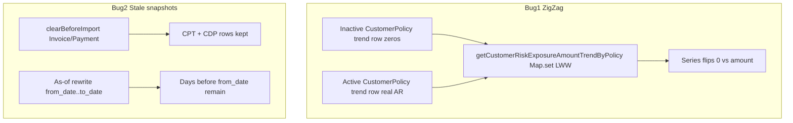

# Fix Policy risk exposure zig-zag + snapshot cleanup

**ClickUp:** [Fix Policy risk exposure zig-zag + clean snapshots on Invoice/Payment clear](https://app.clickup.com/t/869eyn2r2) — status `in progress`, **not implemented**.

**Repo:** backend only (`archaser-backend`). Branch from latest `staging`: `fix/CU-869eyn2r2-risk-exposure-snapshots` (leave existing locale leftovers branches alone).

**Product rule for this fix:** charts/snapshots must not keep stale AR/risk after Invoice/Payment clear, and must not oscillate when inactive + active `CustomerPolicy` rows share one insurance policy.

## Decisions (locked)

- **Chart read:** aggregate with `MAX(at_risk_exposure)` (and MAX for sibling amount fields) per `(insurance_policy_id, snapshot_date)` — deterministic and fixes legacy duplicates without a data migration.
- **Snapshot write:** keep active-only upserts (`loadActiveCustomerPoliciesForTrendSync`). At rewrite/backfill start, also delete **all** inactive-`CustomerPolicy` CPT rows in scope (not only the current day). Keep existing per-day `pruneInactiveCustomerPolicyTrendRows`.
- **Clear scope:** on Invoice and/or Payment clear (after those entity steps succeed in `clearBeforeImport`):
  - Always delete `CustomerPolicyTrend` for account/customer scope.
  - On **account-wide** clears (`customerId` null) also delete `CreditDashboardDailySnapshot` and `InsurancePolicyTrend` (holds `total_open_ar` / usage rollups — research confirmed these stay stale after AR wipe). Skip country/named policy trends (config-only).
  - Do **not** wipe account CDP/IPT on customer-scoped clear — those tables have no customer grain.
- **Pre-window orphans:** before as-of rewrite drain / Generate day loop, delete CPT (scoped) and CDP (+ IPT) with `snapshot_date < from_date` when the rewrite is account-wide; CPT-only when customer-scoped.
- **Out of scope:** `InsurancePolicyCountryTrend` / `NamedPolicyTrend`; one-off SQL datafix scripts; FE changes; tests unless requested.
- **Do not rely on post-sync Generate alone** — it only upserts the rewrite window and leaves older days stale after a full clear.

## Implementation

### 1) Shared purge helpers (credit-insurance-domain)

Add a small module (e.g. [`packages/credit-insurance-domain/src/credit-insurance/domain/creditSnapshotHistoryCleanup.ts`](packages/credit-insurance-domain/src/credit-insurance/domain/creditSnapshotHistoryCleanup.ts)) and export from [`packages/credit-insurance-domain/src/index.ts`](packages/credit-insurance-domain/src/index.ts):

- `deleteCustomerPolicyTrendForScope({ accountId, customerId?, dbClient? })`
- `deleteCreditDashboardDailySnapshotsForAccount({ accountId, dbClient? })`
- `deleteInsurancePolicyTrendForAccount({ accountId, dbClient? })`
- `deleteCreditSnapshotHistoryBeforeDate({ accountId, customerIds?, beforeDate, dbClient? })` — CPT always; CDP + IPT only when `customerIds` empty/omitted
- `deleteInactiveCustomerPolicyTrendRowsForScope({ accountId, customerIds?, dbClient? })` — `DELETE … USING CustomerPolicy WHERE is_active = false` (no date filter)

Reuse raw SQL style from [`customerPolicyTrendBatchUpsert.ts`](packages/credit-insurance-domain/src/credit-insurance/domain/customerPolicyTrendBatchUpsert.ts) `pruneInactiveCustomerPolicyTrendRows`.

### 2) Bug 1 — chart read

In [`getCustomerRiskExposureAmountTrendByPolicy`](packages/credit-insurance-domain/src/credit-insurance/domain/customerPolicyTrendService.ts) (~2023):

- Change the SQL to `GROUP BY snapshot_date, insurance_policy_id` with `MAX(...)` on `at_risk_exposure`, `usage_amount`, `capacity_gap_amount`, `terms_breach_amount`, and `MAX(ip.policy_number)` (or join after aggregate).
- Keep the in-memory series fill; `Map.set` then becomes one row per day/policy.

### 3) Bug 1 — rewrite start cleanup of inactive CPT

Call `deleteInactiveCustomerPolicyTrendRowsForScope` once at the start of:

- as-of rewrite drain item in [`asOfRewriteQueue.ts`](packages/credit-insurance-domain/src/credit-insurance/domain/asOfRewriteQueue.ts) (before the day loop)
- Generate/backfill run in [`creditAsOfBackfillJob.ts`](packages/credit-insurance-domain/src/credit-insurance/domain/creditAsOfBackfillJob.ts) (before the day loop)

### 4) Bug 2 — clear on Invoice/Payment purge

In [`packages/billing-connector/src/purge/clearBeforeImport.ts`](packages/billing-connector/src/purge/clearBeforeImport.ts) inside `clearBeforeImport`, when targets include `Invoice` and/or `Payment` (before or after those entity deletes; prefer **after** so cancelled mid-invoice delete does not leave emptied charts while invoices remain):

- Always: `deleteCustomerPolicyTrendForScope` for `accountId` / optional `customerId`
- If `customerId == null`: also `deleteCreditDashboardDailySnapshotsForAccount` + `deleteInsurancePolicyTrendForAccount`

Import helpers from `@archaser/credit-insurance-domain` (already a dependency). Hook inside `clearBeforeImport` after Invoice/Payment succeed (not only in `runInProcessSync`) so purge stays part of the clear contract.

### 5) Bug 2 — pre-`from_date` orphan delete

In the same rewrite/backfill start sites as (3), call `deleteCreditSnapshotHistoryBeforeDate` with the job/queue **`from_date`** (not `resumeFrom` / checkpoint) and optional `customerIds`.

**When to run (important):** only once when beginning a window — i.e. drain item before the day loop always uses queue `from_date`; Generate only when `checkpoint_date == null` or `resumeFrom === jobFromDate`. Do **not** re-delete on every mid-run checkpoint resume (would not wipe rewritten days incorrectly relative to a widened window; widen already nulls checkpoint via enqueue merge).

Order at start of a fresh rewrite/backfill window: inactive-CP CPT purge → delete `snapshot_date < from_date` → existing day loop upserts.

Optionally mirror the same pre-window CPT delete in `rewriteCustomerAsOfRange` (interactive CPT) if that path can leave orphans the same way.

## Codebase scan

**Required**
- [`customerPolicyTrendService.ts`](packages/credit-insurance-domain/src/credit-insurance/domain/customerPolicyTrendService.ts) — chart aggregation
- New `creditSnapshotHistoryCleanup.ts` + export in [`index.ts`](packages/credit-insurance-domain/src/index.ts)
- [`clearBeforeImport.ts`](packages/billing-connector/src/purge/clearBeforeImport.ts) — Invoice/Payment snapshot purge
- [`asOfRewriteQueue.ts`](packages/credit-insurance-domain/src/credit-insurance/domain/asOfRewriteQueue.ts) — start-of-drain cleanup
- [`creditAsOfBackfillJob.ts`](packages/credit-insurance-domain/src/credit-insurance/domain/creditAsOfBackfillJob.ts) — start-of-Generate cleanup

**Optional / out of scope unless requested**
- One-time datafix for account `10149` / customer `21362`
- Unit tests for MAX aggregation / purge helpers
- `InsurancePolicyCountryTrend` / `NamedPolicyTrend` cleanup
- FE customer dashboard chart components (consume API as-is)

**No change needed**
- `loadActiveCustomerPoliciesForTrendSync` — already `is_active: true`
- Per-day `pruneInactiveCustomerPolicyTrendRows` — keep as defense in depth
- Frontend repos / locale leftovers branches

## Testing Strategy

Mapped to How to test on the ClickUp task (manual; no new automated tests unless asked):

1. Customer with inactive+active CP for same policy (e.g. 21362) — Policy risk exposure flat at invoice at-risk, not square-wave.
2. Single active CP customers unchanged.
3. After rewrite, no conflicting zero + non-zero CPT for same policy+day (or chart still correct via MAX).
4. Start backfill clear Invoice+Payment — CPT (and account CDP/IPT) for scope gone after clear; do not rely on Generate alone.
5. Seed CPT before rewrite `from_date` — after rewrite those days are gone.

## Suggest plan improvements

- Easy to miss: customer-scoped clear must **not** wipe account CDP/IPT.
- Easy to miss: clear-time purge is required even when rewrite later no-ops (zero remaining invoices); post-sync Generate only covers the pending window.
- Easy to miss: pre-`from_date` delete must use queue/job `from_date`, and only on fresh window start — not every checkpoint resume ([as-of rewrite scan](3e13e6cc-fac2-4c9e-84b7-09665aa29457)).
- Incorrect assumption to avoid: “write path already active-only so chart is fine” — legacy inactive rows still zig-zag until read-side MAX + inactive purge.
- Cross-cutting: no i18n/styling; migration not required (DELETE only).
- Research note ([clearBeforeImport scan](fc118062-7e79-4f2c-8b2b-7bbb896585fb)): Customer clear already cascades CPT via FK; Invoice/Payment clear does not.
